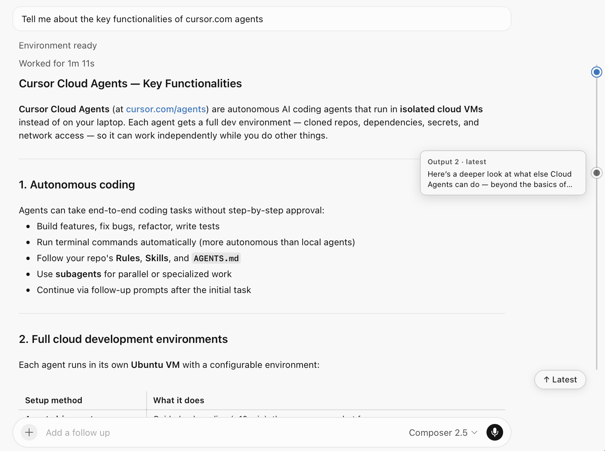

# Cursor Agents Output Navigator

An output navigator for Cursor cloud agents.

## What it solves

When using Cursor agents in the cloud, I found it rather tricky to get to the top of the agent's output, since the sticky headers mask how close you are to the top. So I had my agent spin up a script to solve this for me.

This adds an easy way to hop to the top of the most recent output, or any previous output in the session.

## Install

1. Get a userscript manager: [Userscripts](https://apps.apple.com/app/userscripts/id1463298887) (Safari) or [Tampermonkey](https://www.tampermonkey.net/) (Chrome / Firefox / Edge).
2. Add the script from this URL:
   ```
   https://raw.githubusercontent.com/elliottlawson/cursor-output-navigator/main/cursor-agents-output-nav.user.js
   ```
3. Reload [cursor.com/agents](https://cursor.com/agents). Dots appear on the right edge: click one to jump to that output, hover for a preview, or use the ↑ Latest pill.


